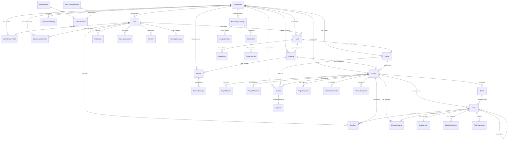
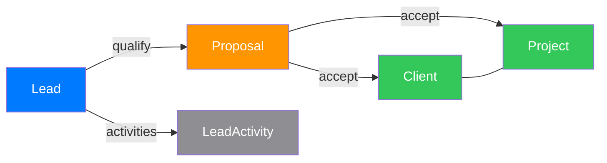
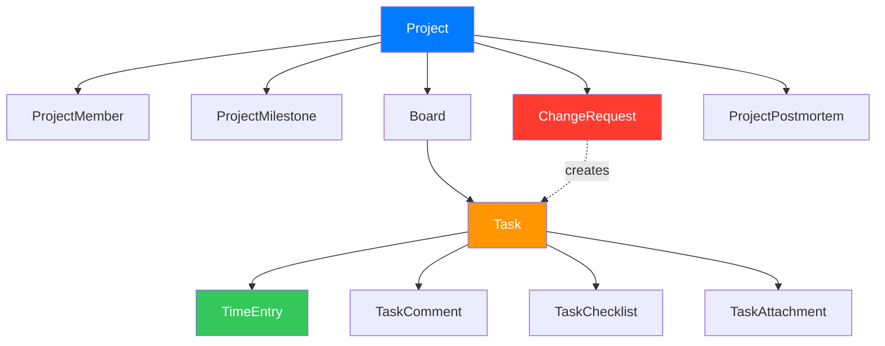
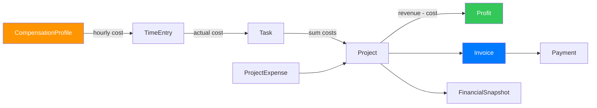
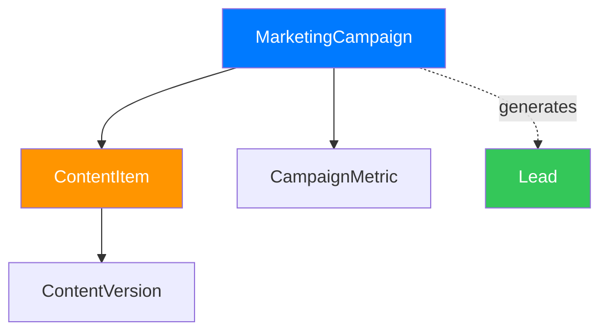
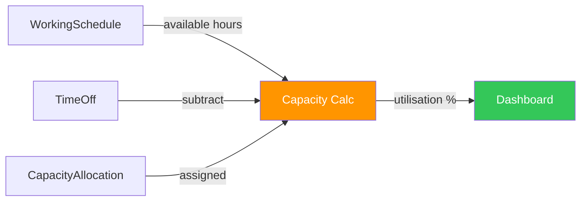

# Entity Relationship Diagram

## Full System ER Diagram

## Sales Engine Flow

## Delivery Engine Flow

## Finance Engine Flow

## Marketing Engine Flow

## Capacity Engine Flow

---

## Model Responsibilities

### Identity & Organisation

| Model | Responsibility |
|-------|---------------|
| **Organisation** | Tenant boundary. Holds settings (currency, timezone, capacity split, billable %). Every entity scoped to one org. |
| **User** | Authentication identity. Email + password hash. Role assignment. Linked to one org. |
| **TeamMemberProfile** | Employment details: title, department, skills, employment type, weekly capacity. |
| **CompensationProfile** | Salary + all cost allocations. Computes fully-loaded monthly cost and internal hourly cost. Versioned for historical accuracy. |

### Sales

| Model | Responsibility |
|-------|---------------|
| **Lead** | Potential opportunity. Tracks source, value, probability, follow-up dates, status lifecycle. |
| **LeadActivity** | Interaction log (calls, emails, meetings, notes) — stored separately, not embedded. |
| **Client** | Converted lead or direct client. Contact + billing info. Links to org. |
| **Proposal** | Priced offer with line items from service catalogue. Tracks expected cost, profit, margin. Status lifecycle with state machine. |

### Service Catalogue

| Model | Responsibility |
|-------|---------------|
| **Service** | Standardized offering: pricing type, hour estimates, margin target, risk %, revision limits, required roles. |
| **ServicePackage** | Tiered packaging (Basic/Standard/Premium/Custom) for a service. |

### Delivery

| Model | Responsibility |
|-------|---------------|
| **Project** | Primary work unit. Contract value, budget, timeline, health score, financial actuals. Status lifecycle. |
| **ProjectMember** | User ↔ Project link with billing rate and cost snapshots at assignment time. |
| **ProjectMilestone** | Deliverable checkpoints with dates and optional invoice triggers. |
| **Board** | Kanban board with ordered columns and WIP limits. |
| **Task** | Work item. Classifies type (original scope, bug, revision, etc.). Tracks estimated/actual cost via hourly cost snapshots. |
| **TaskChecklistItem** | Sub-items within a task. |
| **TaskComment** | Discussion thread on tasks (separate collection). |
| **TaskAttachment** | Files attached to tasks. |
| **TimeEntry** | Time logged against a task. Stores hourly cost snapshot at time of work. Approval workflow. |
| **ChangeRequest** | Scope change with estimated cost/price. Must be approved before related tasks can start. |
| **ProjectPostmortem** | Post-project analysis: estimated vs actual, lessons learned. |

### Capacity

| Model | Responsibility |
|-------|---------------|
| **CapacityAllocation** | Planned weekly hours per user per category (delivery, marketing, internal, buffer). |
| **TimeOff** | Leave/vacation records. Subtracts from available capacity. |
| **WorkingSchedule** | Weekly working hours, working days, daily start/end times per user. |

### Finance

| Model | Responsibility |
|-------|---------------|
| **ProjectExpense** | Non-labour project costs (software, hosting, contractor fees). |
| **Invoice** | Billing document with line items. Tracks paid/outstanding amounts. Status lifecycle. |
| **Payment** | Individual payment against an invoice. Idempotency key prevents duplicates. |
| **PayrollPeriod** | Monthly payroll snapshot for org-level cost tracking. |
| **PerformanceReview** | Periodic employee performance assessment with scoring. |
| **FinancialSnapshot** | Point-in-time capture of financial metrics. Prevents recalculating from raw data on every request. |

### Marketing

| Model | Responsibility |
|-------|---------------|
| **MarketingCampaign** | Marketing initiative: objective, channels, budget, targets, status lifecycle. |
| **ContentItem** | Content piece within a campaign. Status lifecycle through content pipeline. |
| **ContentVersion** | Version history for content items. |
| **CampaignMetric** | Tracked metrics: impressions, clicks, leads, conversions, spend, revenue. |

### Platform

| Model | Responsibility |
|-------|---------------|
| **ApprovalRequest** | Generic approval workflow for any entity. |
| **Notification** | In-app notifications with read status. |
| **AuditLog** | Immutable record of important changes (actor, action, old/new values, timestamp, IP). |
| **ActivityLog** | Lightweight activity feed for entity timelines. |
| **OrganisationSetting** | Key-value configuration at tenant level. |

### Automation (Future)

| Model | Responsibility |
|-------|---------------|
| **DomainEvent** | Stored events for audit and future external dispatch. Includes idempotency key and processing status. |
| **AutomationDefinition** | Trigger → action definition (inactive until n8n integration). |
| **AutomationRun** | Execution record of an automation triggered by a domain event. |
